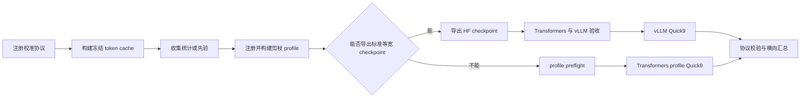

# Static MoE Pruning Framework 使用手册

本文档定义静态 MoE 剪枝框架的扩展、校准、评测和结果管理规范。当前已冻结并完成
正式评测的基线模型为 Qwen3-30B-A3B-Instruct-2507；PP-Frozen-v1 已增加 Gemma4
26B-A4B 和 Qwen3.6-35B-A3B 的 profile/export 适配。当前冻结的快速横向比较协议为
Quick9，正式全量确认协议为 `full6_v1`，带 HumanEval/MBPP 的代码扩展协议为 `full8_v1`。新服务器移植、环境变量和可执行协议定义见：

```text
eval_protocol/README.md
eval_protocol/env.example.sh
eval_protocol/quick9.json
eval_protocol/full6_v1.json
eval_protocol/full8_v1.json
```

## 1. 强制原则

1. 能导出标准 Hugging Face checkpoint 的方法，正式下游评测必须使用
   `checkpoint -> vLLM -> EvalScope openai_api`。
2. `static_expert_profile` 只用于无法被标准 vLLM 表达的异构结构、语义参考、单元测试和
   小规模一致性检查。能用 checkpoint 时不得用 profile 完成正式下游评测。
3. 校准数据只能来自 train split。profile 必须在读取 validation/test 指标前冻结。
4. Quick9 横向比较必须使用完全一致的数据版本、样本顺序、prompt、生成参数和 seed。
5. 所有新评测结果统一写入：

   ```text
   /data01/home/xinpei.gao/evalscope/result
   ```

6. 不得直接把新的正式结果写入 `static_moe_prunning/experiments/results`、
   `WICK/experiments/results` 或 `TENP` 子目录。历史结果保留原位，不迁移、不改写 manifest。
7. 用户要求汇总、比较或监控 `/data01/home/xinpei.gao/evalscope/result` 中的 Quick9 实验
  结果时，必须优先执行 `scripts/watch_eval_reports.sh`。不得先手工扫描 report JSON、临时
  拼接分数或直接运行其他汇总器来绕过该脚本的协议校验。只有第 12 节定义的例外场景才允许
  使用其他工具，并且必须明确说明例外原因和未覆盖的校验项。

## 2. 环境初始化（根据具体服务器不同各自有差异，具体情况具体分析）！！！！！！

```bash
cd /data01/home/xinpei.gao/evalscope

export ROOT=$PWD
export PYTHON_BIN=/data01/home/xuzk/anaconda3/envs/xhquant/bin/python
export VLLM_PYTHON=/data01/home/xuzk/anaconda3/envs/vllm/bin/python
export MODEL_PATH=/data01/datasets/Qwen3-30B-A3B-Instruct-2507
export CODE_ROOT=$ROOT/static_moe_prunning/code
export RESULT_ROOT=$ROOT/result
export LD_LIBRARY_PATH=/data01/home/xuzk/anaconda3/envs/xhquant/lib:${LD_LIBRARY_PATH:-}
export PYTHONPATH=$ROOT:$CODE_ROOT
```

启动任务前必须检查 GPU 和已有进程：

```bash
nvidia-smi
ps -eo pid,ppid,pgid,sid,stat,etime,args |
  grep -E 'vllm|evalscope|run_.*quick9|static_profile' |
  grep -v grep || true
```

## 3. 结果目录和实验命名

### 3.1 强制格式

每次评测只能创建一个顶层实验目录，名称严格采用：

```text
目标模型_剪枝率_推理方式_校准集_评测协议_方法名称_时间戳_随机数种子
```

当前允许值：

| 字段 | 允许值或格式 |
| --- | --- |
| 目标模型 | `Qwen330BA3BInstruct`、`Gemma4-26B-A4B`、`Qwen3.6-35B-A3B`、`DeepSeek-V2-Lite-Chat` |
| 剪枝率 | `25`、`50` |
| 推理方式 | `vllm`、`transformer` |
| 校准集 | `WikiText128x2048`、`Mixed512x1024`；无数据校准方法使用 `CalibrationFree` |
| 评测协议 | `quick9`、`full6_v1`、`full8_v1` |
| 方法名称 | 由方法所在文件夹名称提取，对方法做消融时要体现出消融参数；仅允许字母、数字和连字符，不能包含空格或下划线 |
| 时间戳 | `YYYYMMDDHHMM`，使用任务首次启动时间 |
| 随机数种子 | `42` |

两个已注册的数据校准协议是：

- `WikiText128x2048`：WikiText-2 train，128 条序列，每条 2048 tokens。
- `Mixed512x1024`：WikiText 256 + code 128 + GSM8K 64 + MATH 64，共 512 条序列，
  每条 1024 tokens。

`CalibrationFree` 不是第三个校准集，而是 AIMER、WICK 等不读取校准样本的方法所用的
身份占位值。WikiText-2 full test 和 C4 validation 是 PPL 测试协议，不是校准集。

示例：

```text
Qwen330BA3BInstruct_50_vllm_Mixed512x1024_quick9_MyMethod_202608061430_42
Qwen330BA3BInstruct_50_transformer_CalibrationFree_quick9_WICKGramProtect_202608061430_42
```

使用脚本创建目录，不要手写：

```bash
export EXPERIMENT_DIR="$($CODE_ROOT/scripts/create_result_dir.sh \
  --inference vllm \
  --calibration Mixed512x1024 \
  --method MyMethod)"
echo "$EXPERIMENT_DIR"
```

同一实验的内部布局统一为：

```text
result/<严格实验名>/
  experiment_manifest.json
  checkpoints/<method>/
  server_logs/<method>.log
  <method>/<dataset>/{configs,logs,predictions,reviews,reports}/
```

profile 路径评测可以使用 `<method>/` 作为 work dir；vLLM Quick9 使用
`<method>/<dataset>/`。顶层目录名称仍必须遵守同一格式。

### 3.2 禁止事项

- 不得省略任一字段。
- 不得使用秒级不同名称规避重复实验；时间戳固定到首次启动的分钟。
- 不得在同一顶层目录混用不同 seed、模型、校准协议、评测协议或推理方式。
- 改变 batch、prompt、`max_tokens`、数据 limit 或代码版本后，不得复用旧 prediction cache。
- 方法名中的下划线会破坏字段解析，必须改为 CamelCase 或连字符形式。

## 4. 框架工作流



## 5. 注册新的剪枝方法

当前框架没有单一 Python registry。一个方法只有同时接入 profile builder、launcher
dispatch、结果显示和测试后，才算注册完成。

### 5.1 选择现有方法类型

优先复用已有 builder：

| 类型 | 参考入口 |
| --- | --- |
| 基于 channel cache 的静态宽度分配 | `static_moe_prunning/code/scripts/build_static_expert_profiles.py` |
| Official REAP | `static_moe_prunning/code/scripts/build_official_reap_profile.py` |
| Tail-Risk | `static_moe_prunning/code/scripts/build_tail_risk_profile.py` |
| ENP/TENP | `static_moe_prunning/code/scripts/build_enp_tenp_profiles.py` |
| Calibration-free AIMER | `static_moe_prunning/code/scripts/build_aimer_profile.py` |
| Calibration-free WICK | `WICK/build_wick_profile.py` |

如果新方法只改变宽度分配或 channel 排序，应新增 builder，不要新增 ModelAPI。只有方法
改变 routing、零宽 expert、输出合并或 runtime gather 语义时，才修改：

```text
static_moe_prunning/code/src/runtime_pruner.py
static_moe_prunning/code/src/static_expert_pruning.py
```

### 5.2 输出 profile schema v1

新 builder 必须输出可由 `validate_static_profile_payload()` 验证的 `.pt` payload。最低字段：

```python
profile = {
    'schema_version': 1,
    'method': 'MyMethod',
    'mode': 'per_layer',
    'profile_construction': 'train_calibrated',  # 或 calibration_free
    'test_metrics_used_for_profile': False,
    'num_layers': num_layers,
    'num_experts': num_experts,
    'num_blocks': num_blocks,
    'layer_ids': layer_ids,
    'profile_widths': profile_widths.to(torch.long),
    'total_blocks': int(profile_widths.sum().item()),
    'maximum_blocks': int(profile_widths.numel() * num_blocks),
    'cache_provenance': cache_provenance,
}
```

其中 `profile_widths` 的形状必须为 `[num_layers, num_experts]`，每个元素表示保留的
64-channel block 数。`layer_ids` 必须唯一，预算字段必须与 tensor 精确一致。

### 5.3 PP-Frozen-v1 跨架构适配

PP-Frozen-v1 的 Pure-Pseudo 核心定义不随模型变化：对 routed expert 的 SwiGLU
intermediate channels 进行正向 probe 保护，再由基础 ranking 补齐固定宽度。模型差异由
`PP/pure_pseudo_model_adapter.py` 处理，当前已接入：

| 模型 | model type | 层数 | Routed experts | Expert width | Top-k | 当前状态 |
| --- | --- | ---: | ---: | ---: | ---: | --- |
| Gemma4-26B-A4B | `gemma4_text` | 30 | 128 | 704 | 8 | profile/export 适配完成，端到端验收待完成 |
| Qwen3.6-35B-A3B | `qwen3_5_moe_text` | 40 | 256 | 512 | 8 | profile/export 适配完成，端到端验收待完成 |

适配层支持顶层或 `text_config` 配置、模型专用 router 路径以及 fused
`gate_up_proj`/`down_proj` 权重。Gemma4 路径使用
`model.language_model.layers.{layer}.router.proj.weight` 和
`model.language_model.layers.{layer}.experts.*`；Qwen3.6 路径使用
`model.language_model.layers.{layer}.mlp.gate.weight` 和
`model.language_model.layers.{layer}.mlp.experts.*`。

当前第一版适配范围仅包含 routed experts：shared expert、dense MLP、视觉/音频模块不
参与 PP-Frozen-v1 channel profile，也不应被 exporter 改写。正式宣称某模型适配完成前，
必须额外通过：

1. 真实 checkpoint 的 profile 构建与 payload 校验。
2. exporter 后的 Transformers greedy smoke。
3. vLLM health/chat 验收及 Transformers-vLLM 一致性检查。
4. 至少一个 Quick9 预算的完整下游评测。

Gemma4 和 Qwen3.6 使用通用 exporter：

```bash
PYTHONPATH="$ROOT:$CODE_ROOT" "$PYTHON_BIN" PP/export_uniform_moe.py \
  --model-path "$MODEL_PATH" \
  --profile "$PROFILE" \
  --channel-cache "$CHANNEL_CACHE" \
  --output-dir "$CHECKPOINT_DIR" \
  --retained-channels "$RETAINED_CHANNELS"
```

原 Qwen3-30B-A3B 的既有 exporter 和已冻结 profile 保持不变；跨架构模型必须为各自
模型重新构建 profile，不得复用 Qwen3-30B-A3B 的 ranking cache。

### 5.4 接入 launcher

在 `static_moe_prunning/code/scripts/run_downstream_matrix.sh` 中：

1. 将方法名加入 `usage()` 的 Methods 列表。
2. 在 `profile_path_for_method()` 的 `case` 中返回 profile 路径。
3. 若方法需要 merge plan，在 `merge_plan_path_for_method()` 中注册。
4. 在 `generate_downstream_comparison.py` 的 `VARIANT_ORDER` 中加入显示顺序。

复杂方法可以像 `WICK/run_wick_quick9.sh` 或
`TENP/run_one_model_full8.sh` 一样使用专用 launcher，但仍必须遵守本手册的
结果根目录、命名和评测协议。

### 5.5 测试门禁

至少添加并运行：

```bash
"$PYTHON_BIN" -m pytest \
  static_moe_prunning/code/test/test_static_expert_pruning.py \
  static_moe_prunning/code/test/test_evalscope_model_api.py \
  static_moe_prunning/code/test/test_run_downstream_matrix.py -q
```

新 builder 还必须有自己的 payload、预算和 provenance 测试。

## 6. 注册新的校准集或校准协议

### 6.1 单文本语料

使用：

```text
static_moe_prunning/code/scripts/build_shared_calibration_token_cache.py
```

必须固定 dataset/config/split/text field、序列长度、序列数、offset、tokenizer 和
`protocol_name`。正式协议优先使用本地冻结 Arrow/Parquet 文件并记录文件 SHA。

### 6.2 结构化混合语料

使用：

```text
static_moe_prunning/code/scripts/build_mixed_calibration_token_cache.py
```

新增数据源时必须同时增加：

1. 显式 CLI 参数和本地 train 文件路径。
2. 将结构化样本转成文本的 renderer。
3. 独立 quota 和 component stream 名称。
4. source file SHA、样本顺序和 token SHA。
5. builder 单元测试。

不得使用 validation/test split，不得使用 Quick9 的答案或分数选择 quota。正式 cache
不得覆盖旧文件；新协议必须使用新 `protocol_name` 和新目录。

### 6.3 注册完成标准

cache payload 必须记录：

```text
protocol_name
model/tokenizer identity
source dataset/config/split/files
source file SHA256
sequence length and sequence count
sample order and repetition policy
input_ids SHA256
```

构建后必须冻结 cache 文件 SHA。所有参加同一横向比较的方法必须读取同一个 token tensor，
不能只保证数据集名称相同。

## 7. 注册新的测试协议

当前没有声明式协议 registry。一个测试协议由 launcher 和 validator 共同冻结。

必须定义：

1. 协议名称和版本。
2. 数据集执行顺序。
3. 每个数据集的本地路径、split、subset 和 prompt。
4. per-subset/subject/level limit 与最终期望样本数。
5. 每个数据集的 `max_tokens`、batch、thinking、sampling 和 seed。
6. 结果目录布局、完整性 validator 和聚合方式。
7. 允许复用 cache 的精确条件。

若只是组合已有 benchmark，不需要修改 EvalScope registry。若引入新的 benchmark adapter，
必须使用 EvalScope 的 `@register_benchmark(BenchmarkMeta(...))`，实现 `DataAdapter`，并添加
最小可运行测试。

### 7.1 Qwen3.6-35B-A3B 配置

以下 `max_tokens` 配置属于 **Qwen3.6-35B-A3B**，同时用于 Quick9 和 full6 中对应数据集的
评测 shard，并替换此前固化的 `64/32/32/1024/4096/1536` 配置。新配置根据 Original、
PP-Frozen-v1 B9 和 B6 的历史输出长度、`stop_reason=max_tokens` 比例及答案格式率制定，优先
保证正常推理不在最终答案前被截断，同时避免为剪枝模型的重复退化无限增加生成预算。

其他模型可以借鉴该配置作为更保险的初始值，但不能直接视为跨模型冻结协议。正式固化前
必须使用目标模型的小样本预测检查输出 token 分布、答案格式率、空输出率和
`stop_reason=max_tokens` 比例；若修改任一数据集的上限，必须使用新的 work dir，不得复用旧
prediction cache。

执行顺序严格为：

```text
ARC -> HellaSwag -> WinoGrande -> GSM8K -> MATH-500 -> MMLU
```

Quick9 使用子集抽样；`full6_v1` 使用同一六个数据集的全部样本。两套协议共用下面的
`max_tokens` 生成上限：截断的是每条样本的输出长度，不是评测条数。

| 数据集 | Quick9 抽取 | Quick9 样本数 | full6_v1 样本数 | `max_tokens` |
| --- | --- | ---: | ---: | ---: |
| ARC | Challenge、Easy 各前 300 条 | 600 | 3548 | 2048 |
| HellaSwag | default 前 1000 条 | 1000 | 10042 | 512 |
| WinoGrande | default 前 400 条 | 400 | 1267 | 1024 |
| GSM8K | main 前 128 条，0-shot | 128 | 1319 | 2048 |
| MATH-500 | 5 Levels 各前 20 条 | 100 | 500 | 4096 |
| MMLU | 57 subjects 各前 10 条 | 570 | 14042 | 2048 |

Quick9 总计 2798 条；`full6_v1` 总计 30718 条。两者都是 `shuffle=false`，`seed=42`，
`temperature=0`，`do_sample=false`，`enable_thinking=false`。Quick9 与 full6_v1 都报告
六个数据集分数和六数据集宏平均，不使用样本数加权结果冒充总分。不得把 Quick9 分数与
full6_v1 分数并排发布。vLLM/EvalScope launcher 必须在每个请求中显式传递
`extra_body.chat_template_kwargs.enable_thinking=false`，不能只依赖服务端默认值。
`full6_v1` launcher 不得传 `--limit`。

## 8. 使用 profile 跑评测

仅在方法无法导出标准 checkpoint 或用于一致性检查时使用。

```bash
export METHOD=MyMethod
export PROFILE=/path/to/profile.pt
export CHANNEL_CACHE=/path/to/channel_cache.pt
export EXPERIMENT_DIR="$($CODE_ROOT/scripts/create_result_dir.sh \
  --inference transformer \
  --calibration Mixed512x1024 \
  --method "$METHOD")"
export WORK_DIR=$EXPERIMENT_DIR/$METHOD

CUDA_VISIBLE_DEVICES=0 "$PYTHON_BIN" \
  "$CODE_ROOT/scripts/run_evalscope_static_profile.py" \
  --model-path "$MODEL_PATH" \
  --model-id "Qwen330BA3BInstruct-50-$METHOD" \
  --model-family qwen3 \
  --profile "$PROFILE" \
  --channel-cache "$CHANNEL_CACHE" \
  --expected-profile-file-sha256 "$(sha256sum "$PROFILE" | awk '{print $1}')" \
  --expected-channel-file-sha256 "$(sha256sum "$CHANNEL_CACHE" | awk '{print $1}')" \
  --work-dir "$WORK_DIR" \
  --datasets arc hellaswag winogrande gsm8k math_500 mmlu \
  --dataset-args '{"arc":{"local_path":"/data01/datasets/evalscope_benchmarks/arc","subset_list":["ARC-Challenge","ARC-Easy"]},"hellaswag":{"local_path":"/data01/datasets/evalscope_benchmarks/hellaswag"},"winogrande":{"local_path":"/data01/home/xuzk/workspace/OSTQuant/utils/my_utils/llm_pipeline/datasets/winogrande/data/winogrande_1.1.zip"},"gsm8k":{"local_path":"/data01/datasets/evalscope_benchmarks/gsm8k","few_shot_num":0},"math_500":{"local_path":"/data01/datasets/evalscope_benchmarks/math_500"},"mmlu":{"local_path":"/data01/home/xuzk/workspace/OSTQuant/utils/my_utils/llm_pipeline/datasets/mmlu"}}' \
  --dataset-limits '{"arc":300,"hellaswag":1000,"winogrande":400,"gsm8k":128,"math_500":20,"mmlu":10}' \
  --generation-config '{"max_tokens":4096,"temperature":0.0,"do_sample":false}' \
  --eval-batch-size 1 \
  --seed 42 \
  --no-enable-thinking \
  --moe-backend torch_index_add \
  --no-timestamp \
  --preflight-only
```

先执行 `--preflight-only`。成功后移除该参数开始评测。由于单次 profile runner 只能共享
一个 generation config，示例使用 Quick9 最大值 4096；正式长期运行优先拆成独立 dataset
shard，并使用第 7.1 节的数据集级上限。

断点续跑只能复用原 work dir：

```bash
--use-cache "$WORK_DIR"
```

## 9. 导出 checkpoint 并使用 vLLM 评测

### 9.1 何时可以导出

当前标准 vLLM 路径要求所有 routed experts 具有统一物理中间维度；当前 Qwen3 默认要求
所有 MoE 层也使用相同 `moe_intermediate_size`。异构 TENP、Route-Tail、Tail-Risk profile
不能直接交给标准 vLLM。

当前已有导出器只支持统一宽度 Qwen3 MoE：

```text
WICK/export_uniform_qwen3_moe.py
```

它读取 channel ranking cache 和统一 `retained_channels`，不读取任意异构 profile。

### 9.2 导出标准 HF checkpoint

```bash
export METHOD=MyMethod
export RETAINED_CHANNELS=384
export CHANNEL_CACHE=/path/to/channel_cache.pt
export EXPERIMENT_DIR="$($CODE_ROOT/scripts/create_result_dir.sh \
  --inference vllm \
  --calibration Mixed512x1024 \
  --method "$METHOD")"
export CHECKPOINT_DIR=$EXPERIMENT_DIR/checkpoints/$METHOD

"$PYTHON_BIN" WICK/export_uniform_qwen3_moe.py \
  --model-path "$MODEL_PATH" \
  --channel-cache "$CHANNEL_CACHE" \
  --output-dir "$CHECKPOINT_DIR" \
  --retained-channels "$RETAINED_CHANNELS"
```

导出目录必须是空目录。导出后至少校验：

1. Transformers 能加载并完成 greedy smoke。
2. vLLM 能启动并通过 `/health`、`/v1/models` 和一次 chat completion。
3. 5 到 20 个冻结输入上，Transformers 和 vLLM 没有系统性答案偏移。
4. manifest 记录源模型、profile/channel cache、导出脚本和导出 checkpoint SHA，以及张量
   裁剪前后形状。现有导出器的 manifest 信息不足时，正式实验必须另补审计 manifest。

### 9.3 启动 vLLM

```bash
export METHOD=MyMethod
export MODEL_ID=Qwen330BA3BInstruct-50-$METHOD
export PORT=18080

CUDA_VISIBLE_DEVICES=0 "$VLLM_PYTHON" -m vllm.entrypoints.openai.api_server \
  --model "$CHECKPOINT_DIR" \
  --served-model-name "$MODEL_ID" \
  --host 127.0.0.1 \
  --port "$PORT" \
  --dtype bfloat16 \
  --seed 42 \
  --max-model-len 8192 \
  --max-num-seqs 16 \
  --gpu-memory-utilization 0.90 \
  --generation-config vllm \
  --default-chat-template-kwargs '{"enable_thinking":false}' \
  >"$EXPERIMENT_DIR/server_logs/$METHOD.log" 2>&1
```

### 9.4 用 EvalScope 访问 vLLM

```bash
bash WICK/run_vllm_quick9.sh \
  "$MODEL_ID" \
  "http://127.0.0.1:$PORT" \
  "$METHOD" \
  "$EXPERIMENT_DIR"
```

正式 runner 必须保证 GSM8K/MATH prompt 与 profile runner 相同。每个方法使用独立 served
model name、端口、work dir 和 cache。不要复用另一方法或另一 batch 的 prediction cache。

### 9.5 归档、删除和恢复导出权重

完成 checkpoint 验收和评测后，可以删除体积较大的 `model-*.safetensors` 分片，但必须先在
checkpoint 原目录生成可执行恢复脚本和恢复清单。统一使用：

```text
scripts/archive_checkpoint_weights.sh
scripts/archive_checkpoint_weights.py
```

Shell 包装器支持三种目标范围：

- 单个 `checkpoints/<method>/` 目录。
- 单个顶层实验目录。
- `/data01/home/xinpei.gao/evalscope/result`，批量处理其中所有具有
  `pruning_export_manifest.json` 的 checkpoint。

正常使用时只修改 `scripts/archive_checkpoint_weights.sh` 顶部的 `TARGET_PATH`、`ACTION`
和 `ALLOW_DELETE`。也可以用同名环境变量临时覆盖。

#### 预览并生成恢复文件

先执行非破坏性预览：

```bash
TARGET_PATH="$EXPERIMENT_DIR" \
ACTION=preview \
bash scripts/archive_checkpoint_weights.sh
```

该步骤会在每个 checkpoint 原目录生成或更新：

```text
weight_recovery_manifest.json
restore_weights.sh
```

恢复清单记录源模型、profile、channel cache、导出器、恢复 Python、导出参数、每个权重
分片的大小和 SHA256。预览不会删除权重。

#### 受保护地删除权重

确认预览输出的 checkpoint 数量、分片数量和总空间后执行：

```bash
TARGET_PATH="$EXPERIMENT_DIR" \
ACTION=delete \
ALLOW_DELETE=true \
bash scripts/archive_checkpoint_weights.sh
```

删除还要求在交互终端输入脚本显示的精确确认短语，例如：

```text
DELETE 1 CHECKPOINTS 16 SHARDS
```

删除前脚本会对整个目标范围统一预检。任一 checkpoint 存在依赖缺失、分片缺失、分片大小
不符、恢复文件不完整或路径越过 `result/` 的情况时，在删除任何分片前整体终止。删除操作只
移除恢复清单记录的 `model-*.safetensors`；config、tokenizer、权重索引、实验结果、日志、
`pruning_export_manifest.json`、恢复清单和恢复脚本必须保留。

#### 恢复 checkpoint

通过包装器恢复单个实验或批量恢复：

```bash
TARGET_PATH="$EXPERIMENT_DIR" \
ACTION=restore \
bash scripts/archive_checkpoint_weights.sh
```

恢复前需要输入精确确认短语，例如：

```text
RESTORE 1 CHECKPOINTS 16 SHARDS
```

也可以直接恢复一个 checkpoint：

```bash
"$CHECKPOINT_DIR/restore_weights.sh"
```

恢复流程先导出到同一文件系统的临时目录，检查所有生成分片的 SHA256 后，再将它们移动到
原 checkpoint 目录。包装器还会在恢复结束后重新计算每个分片的 SHA256。以下状态会被拒绝：

- 原目录中只存在部分权重分片，避免混合新旧权重。
- 恢复清单没有记录完整分片 SHA256 或大小。
- 源模型、profile、channel cache、导出器或恢复 Python 不存在。
- 可用磁盘空间小于记录的待恢复权重大小。

权重已经完整存在时，`ACTION=restore` 会输出 `ALREADY_PRESENT` 并跳过，不覆盖现有分片。

#### 恢复依赖和验证边界

删除权重后不得移动或删除恢复清单记录的源模型、profile、channel cache 和导出器。当前恢复
环境固定为：

```text
/data01/home/xuzk/anaconda3/envs/xhquant/bin/python
```

该流程已经对 `PurePseudo-K8-Q4-B11of12` 做过真实端到端验证：在隔离目录重新生成 16 个
分片、共 52.37 GiB，并逐分片确认原权重 SHA256、恢复清单 SHA256 和重建权重 SHA256
完全一致。其他 exporter 共享同一恢复与校验框架，但不能仅凭依赖预检声称已经逐 checkpoint
做过完整重建；新增 exporter 后至少应选择一个代表 checkpoint 完成同样的隔离恢复验证，再
批量删除该 exporter 产生的权重。

## 10. ENP final6 实验记录

ENP 25% 和 50% 剪枝实验已于 2026-08-08 完成，均使用统一宽度 Hugging Face checkpoint、
vLLM 和 `full6_v1`（final6）协议。两档实验共享同一份冻结的 WikiText-2 train 校准数据，
未使用任何 validation/test 指标进行 profile 选择。

### 10.1 固定配置

- 模型：`Qwen3-30B-A3B-Instruct-2507`
- 校准协议：`c1_wikitext_train_128x2048_seed42_screening_v1`
- 校准缓存：`128 x 2048` tokens，input_ids SHA256：
  `20fb85e866b6e3cf3e9b8dd37342403192c414fad4548568a19ccf446b63ab1f`
- 校准缓存文件 SHA256：`11324347a87608d294c47a157a5f3791a72e75b0ab7c5752fae096473da5ffb1`
- 评测协议：`full6_v1`（final6），seed `42`，temperature `0.0`，`do_sample=false`
- 数据集顺序：ARC、HellaSwag、WinoGrande、GSM8K、MATH-500、MMLU
- MATH-500：Level 1 至 Level 5，每级 20 条，共 100 条，`max_tokens=4096`

### 10.2 结果

分数为 accuracy；Full6 Macro 为六个数据集分数的算术平均。

| Experiment | Pruning | Retained channels | ARC | HellaSwag | WinoGrande | GSM8K | MATH-500 | MMLU | Full6 Macro |
| --- | ---: | ---: | ---: | ---: | ---: | ---: | ---: | ---: | ---: |
| ENP-25-WikiText128x2048 | 25% | 576 / 768 | 0.9697 | 0.8238 | 0.6701 | 0.9113 | 0.4776 | 0.8300 | **0.7804** |
| ENP-50-WikiText128x2048 | 50% | 384 / 768 | 0.7656 | 0.4874 | 0.5280 | 0.5610 | 0.0373 | 0.6900 | **0.5116** |

### 10.3 Artifact 与结果路径

- ENP-25 checkpoint：`result/Qwen330BA3BInstruct_25_vllm_WikiText128x2048_full6_v1_ENP_202608081610_42/checkpoints/ENP`
- ENP-50 checkpoint：`result/Qwen330BA3BInstruct_50_vllm_WikiText128x2048_full6_v1_ENP_202608081610_42/checkpoints/ENP`
- ENP-25 reports：`result/Qwen330BA3BInstruct_25_vllm_WikiText128x2048_full6_v1_ENP_202608081610_42/ENP`
- ENP-50 reports：`result/Qwen330BA3BInstruct_50_vllm_WikiText128x2048_full6_v1_ENP_202608081610_42/ENP`
- ENP-25 profile：`static_moe_prunning/experiments/profiles/qwen3_wikitext128x2048_enp/enp_25pct_per_layer.pt`
- ENP-50 profile：`static_moe_prunning/experiments/profiles/qwen3_wikitext128x2048_enp/enp_50pct_per_layer.pt`
- Channel cache：`static_moe_prunning/experiments/calibration/qwen3_wikitext128x2048_enp/enp_signed_projection_channels_b64.pt`

两档实验均生成 ARC、HellaSwag、WinoGrande、GSM8K、MATH-500 和 MMLU 六个 report，
checkpoint 已通过 Transformers greedy smoke，并由 vLLM 成功加载完成正式评测。

## 11. 推理方式选择

```text
能导出统一宽度标准 HF checkpoint
  -> 必须选择 vllm

无法被标准 vLLM 表达的异构 expert width
  -> 允许选择 transformer，并在 manifest 中记录例外原因
```

`transformer` 指 `static_expert_profile` 本地运行时。其吞吐和延迟不能与 vLLM 结果直接比较。
若比较方法效果，可以比较分数；若比较推理性能，所有方法必须使用相同推理方式和运行参数。

## 12. 启动前检查清单

- 实验目录位于 `/data01/home/xinpei.gao/evalscope/result` 且名称通过创建脚本校验。
- 方法名称、剪枝率、校准协议、Quick9、seed 和推理方式与 manifest 一致。
- 能导出 checkpoint 的方法已选择 vLLM，而不是 profile runtime。
- profile、channel cache、checkpoint 和代码版本 SHA 已记录。
- Quick9 数据顺序和最终数量为 600/1000/400/128/100/570。
- 新实验未复用不兼容的 prediction cache。
- vLLM 与 Transformers smoke、一致性门禁已通过。
- `nvidia-smi` 确认目标 GPU 真正空闲且不会抢占其他任务。

## 13. 结果汇总、比较和监控

用户要求总结实验结果、比较多个方法、查看 Quick9 宏平均或监控结果更新时，首选入口为：

```text
scripts/watch_eval_reports.sh
```

底层实现为：

```text
scripts/watch_eval_reports.py
```

Shell 包装器默认使用带有 PyYAML 的 xhquant 环境，先按照本手册第 3.1 和 7.1 节校验实验，
再输出实验级横向比较。汇总结果时不得直接把 report 中的 `model_name` 当作方法身份；同一
实验的六个 dataset shard 必须按顶层实验目录和 `experiment_manifest.json` 合并。

### 13.1 选择要比较的实验

编辑 `scripts/watch_eval_reports.sh` 顶部的 `EXPERIMENT_PATHS` 数组：

```bash
EXPERIMENT_PATHS=(
    "/data01/home/xinpei.gao/evalscope/result/Qwen330BA3BInstruct_25_vllm_WikiText128x2048_quick9_ENP_202608081200_42"
    "/data01/home/xinpei.gao/evalscope/result/Qwen330BA3BInstruct_50_vllm_WikiText128x2048_quick9_ENP_202608081200_42"
)
```

然后执行：

```bash
bash scripts/watch_eval_reports.sh
```

数组留空时扫描 `RESULT_ROOT` 下的全部顶层实验：

```bash
EXPERIMENT_PATHS=(
)
```

默认全量模式会列出被拒绝的旧目录、不完整实验和协议不合规实验，只把通过校验的实验加入
对比表。显式填写路径时，任一实验校验失败都会拒绝本次比较，避免误把不兼容结果并排发布。

### 13.2 快照、持续监控和 subset 明细

单次汇总：

```bash
WATCH_SECONDS=0 bash scripts/watch_eval_reports.sh
```

每 30 秒刷新：

```bash
WATCH_SECONDS=30 bash scripts/watch_eval_reports.sh
```

显示 ARC subset、MATH Level 和 MMLU subject 明细：

```bash
SHOW_DETAILS=true bash scripts/watch_eval_reports.sh
```

默认输出每个实验的 ARC、HellaSwag、WinoGrande、GSM8K、MATH-500、MMLU 分数和六数据集
宏平均。行标签包含剪枝率、校准协议和方法名，避免同一方法的 25% 与 50% 实验混淆。

### 13.3 汇总前的强制校验

脚本至少校验：

- 顶层目录名称符合第 3.1 节格式。
- `experiment_manifest.json` 与目录中的模型、剪枝率、推理方式、校准协议、Quick9、方法、
  时间戳和 seed 一致。
- 六个 Quick9 report 和 `configs/task_config.yaml` 均存在且唯一。
- aggregate report 样本数精确为 600 / 1000 / 400 / 128 / 100 / 570。
- ARC-Challenge 和 ARC-Easy 各 300 条。
- MATH-500 的 Level 1 到 Level 5 各 20 条。
- MMLU 有 57 个 subject，且每个 subject 为 10 条。
- dataset path、split、subset、prompt、limit、seed、shuffle、GSM8K few-shot 和 generation
  config 符合冻结协议。
- 被比较实验之间的数据路径、prompt、subset、limit 和 generation config 完全一致。
- server log 保存 vLLM 参数时，`enable_thinking=false`、BF16、seed、`max_model_len=8192`、
  `max_num_seqs=16` 和 `generation_config=vllm` 符合约定。

旧实验若没有保存能够证明 `enable_thinking` 或 vLLM server 参数的日志证据，脚本必须显示
`UNVERIFIED MANUAL FIELDS`，不能把缺失证据当作已验证通过。`ALLOW_INVALID=true` 仅用于
诊断，不得用于发布正式横向结论。

### 13.4 允许使用其他汇总方式的例外

只有以下情况可以不以 `scripts/watch_eval_reports.sh` 作为最终汇总入口：

- 目标不是本手册定义的 Quick9，例如 PPL、Code Benchmark、MMLU-Pro 或自定义协议。
- 需要分析 prediction 级错误类型、token 长度、触顶率、吞吐分布或统计显著性，而不是汇总
  Quick9 六数据集分数。
- 实验使用尚未接入该脚本的新结果 schema；此时应优先扩展脚本和测试，而不是长期维护临时
  汇总命令。
- 脚本明确报出其无法解析的结构或缺失字段，且当前任务要求诊断该异常本身。

使用例外方式时，输出必须说明：为何不能使用首选脚本、选择了哪些实验、跳过了哪些 manual
校验，以及结果是否允许与现有 Quick9 表直接比较。若只是用户要求“总结这些实验结果”而未
指定特殊分析，默认必须执行 `scripts/watch_eval_reports.sh`。

## 14. 完成后验收

```bash
find "$EXPERIMENT_DIR" -type f | sort
grep -R "Traceback\|CUDA out of memory\|OutOfMemoryError" "$EXPERIMENT_DIR" || true
```

必须按协议确认六个 aggregate report 样本数精确为：

Quick9：

```text
ARC 600
HellaSwag 1000
WinoGrande 400
GSM8K 128
MATH-500 100
MMLU 570
```

full6_v1：

```text
ARC 3548
HellaSwag 10042
WinoGrande 1267
GSM8K 1319
MATH-500 500
MMLU 14042
```

缺失 shard、样本数错误、配置漂移或未说明异常时，不得发布横向比较结果。Quick9 与
full6_v1 不得混表。