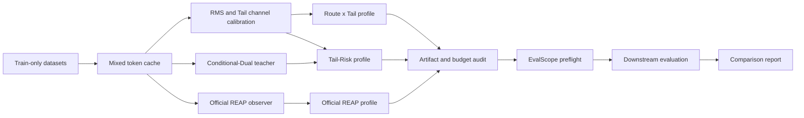

# Static MoE Pruning Framework Runbook

本文档用于在新的 VS Code 窗口或新的终端会话中，快速接手
`static_moe_prunning` 框架。内容以当前 Qwen3-30B-A3B-Instruct-2507、
512 x 1024 混合校准协议和 EvalScope 下游评测流程为基准。

完整的框架扩展、校准协议注册、Quick9 注册、checkpoint/vLLM 评测和结果目录命名规范见：

```text
static_moe_prunning/docs/STATIC_MOE_PRUNING_FRAMEWORK_MANUAL.md
```

> 重要：不要仅凭文件名判断实验是否兼容。校准 token SHA、profile 文件
> SHA、channel cache SHA、模型路径、数据集参数和 generation config 都是
> 实验身份的一部分。

## 1. 一分钟接手

进入仓库并初始化环境：

```bash
cd /data01/home/xinpei.gao/evalscope

export ROOT=$PWD
export PYTHON_BIN=/data01/home/xuzk/anaconda3/envs/xhquant/bin/python
export MODEL_PATH=/data01/datasets/Qwen3-30B-A3B-Instruct-2507
export CODE_ROOT=$ROOT/static_moe_prunning/code
export LD_LIBRARY_PATH=/data01/home/xuzk/anaconda3/envs/xhquant/lib:${LD_LIBRARY_PATH:-}
export PYTHONPATH=$ROOT:$CODE_ROOT
```

定义当前冻结产物：

```bash
export MIXED_CACHE=$ROOT/static_moe_prunning/experiments/calibration/qwen3_mixed_train_wikitext256_mbpp128_gsm8k64_math64_20260802/mixed_train_512x1024_code_augmented.pt
export CALIBRATION_ROOT=$ROOT/static_moe_prunning/experiments/calibration/qwen3_mixed_512x1024_code_augmented_20260802
export RMS_CACHE=$CALIBRATION_ROOT/channels_rms_512x1024.pt
export TAIL_CACHE=$CALIBRATION_ROOT/tail_channels/qwen3_channels_b64_tail_0p50.pt
export PROFILE_ROOT=$ROOT/static_moe_prunning/experiments/profiles/qwen3_mixed_512x1024_code_augmented_20260802
export RESULTS_ROOT=$ROOT/static_moe_prunning/experiments/results/qwen3_mixed_512x1024_global_quick9_20260803
```

先确认文件、GPU 和正在运行的任务：

```bash
for path in "$MIXED_CACHE" "$RMS_CACHE" "$TAIL_CACHE" "$PROFILE_ROOT"; do
  test -e "$path" && echo "OK: $path" || echo "MISSING: $path"
done

nvidia-smi
ps -eo pid,ppid,pgid,sid,stat,etime,args |
  grep -E 'run_evalscope_static_profile|run_downstream_matrix' |
  grep -v grep || true
```

当前冻结校准协议：

| 来源 | 序列数 | 每序列 token | 说明 |
| --- | ---: | ---: | --- |
| WikiText-2 train | 256 | 1024 | 从冻结的 WikiText token cache 重切分 |
| MBPP + Python Code Instructions 18K train | 128 | 1024 | MBPP 不足部分由同类代码训练集补齐，不重复样本流 |
| GSM8K train | 64 | 1024 | 训练集 |
| MATH train | 64 | 1024 | competition_math 训练集 |
| 合计 | 512 | 1024 | 总计 524,288 tokens |

冻结身份：

```text
input_ids SHA256: 588f0e45bc49601c3fb951828c0b1bb78bf15809e193ff9c5a854ef10483c03a
cache file SHA256: 8052987634bab450559c18e5ebfb55ccd82b8240cd93434268e911bcf91db1a7
tail channel file SHA256: 98f99772df910883ebc7dd8e73f62c76645c5e2d322aaff4e42e1b8ad98eac9d
RMS channel file SHA256: 001ae6846df0512121181683b1a03a57fe6cba9f9400a3b53d81175de2348f95
```

## 2. 完整工作流



核心入口：

| 阶段 | 脚本 |
| --- | --- |
| WikiText 基础 cache | `static_moe_prunning/code/scripts/build_shared_calibration_token_cache.py` |
| 混合校准集 | `static_moe_prunning/code/scripts/build_mixed_calibration_token_cache.py` |
| RMS/Tail 通道统计 | `static_moe_prunning/code/scripts/calibrate_hessian_channels.py` |
| Official REAP | `static_moe_prunning/code/scripts/build_official_reap_profile.py` |
| AIMER | `static_moe_prunning/code/scripts/build_aimer_profile.py` |
| Conditional-Dual teacher | `static_moe_prunning/code/scripts/collect_dynamic_regret_teacher.py` |
| Route x Tail | `static_moe_prunning/code/scripts/build_static_expert_profiles.py` |
| Tail-Risk | `static_moe_prunning/code/scripts/build_tail_risk_profile.py` |
| 三方法编排 | `static_moe_prunning/code/scripts/run_three_profiles_512x1024.sh` |
| 单 profile 评测 | `static_moe_prunning/code/scripts/run_evalscope_static_profile.py` |
| 多方法矩阵评测 | `static_moe_prunning/code/scripts/run_downstream_matrix.sh` |
| 比较报告 | `static_moe_prunning/code/scripts/generate_downstream_comparison.py` |

## 3. 从零准备校准集

### 3.1 数据约束

校准数据必须满足：

- 只使用 train split，不能使用测试集或下游评测答案。
- 相同实验的所有稀疏方法共享完全相同的 token tensor。
- 不传 `--allow-source-repetition`，除非明确设计了重复协议。
- 保存源文件路径、源文件 SHA、模型/Tokenizer 身份和 token SHA。
- 新协议使用新目录，不能覆盖已经用于评测的冻结 cache。

先检查本机数据文件位置；若文件名发生变化，应修改命令而不是创建同名软链接来掩盖变化：

```bash
find /data01/datasets/evalscope_benchmarks -maxdepth 4 -type f \
  \( -name '*.parquet' -o -name '*.json' -o -name '*.jsonl' \) |
  grep -E '/(gsm8k|mbpp|math_500|competition_math|python_code)' |
  sort
```

### 3.2 构建冻结 WikiText token cache

当前流程先构建 128 x 2048，再由 mixed builder 重切成 256 x 1024：

```bash
export WT_CACHE=$ROOT/static_moe_prunning/experiments/calibration/reap_50pct_screening/c1_wikitext_train_128x2048.pt

"$PYTHON_BIN" "$CODE_ROOT/scripts/build_shared_calibration_token_cache.py" \
  --model-path "$MODEL_PATH" \
  --dataset wikitext \
  --config wikitext-2-raw-v1 \
  --split train \
  --text-field text \
  --sequence-length 2048 \
  --calibration-sequences 128 \
  --token-offset 0 \
  --protocol-name c1_wikitext_train_128x2048_v1 \
  --output-cache "$WT_CACHE"
```

### 3.3 构建 512 x 1024 混合 cache

```bash
export PROTOCOL_NAME=qwen3_mixed_train_wikitext256_code128_gsm8k64_math64_512x1024_YYYYMMDD
export NEW_CAL_ROOT=$ROOT/static_moe_prunning/experiments/calibration/$PROTOCOL_NAME
export NEW_MIXED_CACHE=$NEW_CAL_ROOT/mixed_train_512x1024.pt
mkdir -p "$NEW_CAL_ROOT"

"$PYTHON_BIN" "$CODE_ROOT/scripts/build_mixed_calibration_token_cache.py" \
  --model-path "$MODEL_PATH" \
  --output-cache "$NEW_MIXED_CACHE" \
  --wikitext-cache "$WT_CACHE" \
  --gsm8k-train /data01/datasets/evalscope_benchmarks/gsm8k/main/train-00000-of-00001.parquet \
  --mbpp-train /data01/datasets/evalscope_benchmarks/mbpp/full/train-00000-of-00001.parquet \
  --code-train /data01/datasets/evalscope_benchmarks/python_code_instructions_18k_alpaca/train-00000-of-00001.parquet \
  --math-train /data01/datasets/evalscope_benchmarks/competition_math/train-00000-of-00001.parquet \
  --sequence-length 1024 \
  --wikitext-sequences 256 \
  --gsm8k-sequences 64 \
  --arc-sequences 0 \
  --mbpp-sequences 128 \
  --math-sequences 64 \
  --protocol-name "$PROTOCOL_NAME"
```

注意：

- `--arc-sequences` 默认不是 0；本协议必须显式写 `--arc-sequences 0`。
- `--code-train` 可以重复传入，以追加多个同类代码训练集。
- MBPP 与追加代码集会合并为同一个 code token stream。
- mixed builder 按来源 round-robin 混合序列。
- 执行前将 `PROTOCOL_NAME` 中的 `YYYYMMDD` 替换为实际日期或版本标签。

### 3.4 校验 cache

```bash
"$PYTHON_BIN" - "$NEW_MIXED_CACHE" <<'PY'
import hashlib
import sys

import torch

path = sys.argv[1]
payload = torch.load(path, map_location='cpu', weights_only=True)
input_ids = payload['input_ids']
print('shape:', tuple(input_ids.shape))
print('sequence_length:', payload['sequence_length'])
print('calibration_sequences:', payload['calibration_sequences'])
print('input_ids_sha256:', payload['input_ids_sha256'])
print('file_sha256:', hashlib.sha256(open(path, 'rb').read()).hexdigest())
print('protocol_name:', payload['protocol_name'])
print('quotas:', payload.get('quotas'))
PY
```

期望形状为 `(1, 524288)`，序列长度为 1024，序列数为 512。

运行校准 builder 的聚焦测试：

```bash
"$PYTHON_BIN" -m pytest \
  static_moe_prunning/code/test/test_build_shared_calibration_token_cache.py \
  static_moe_prunning/code/test/test_build_mixed_calibration_token_cache.py -q
```

## 4. 构建通道统计和稀疏 Profile

### 4.1 RMS 和 Tail channel cache

先确认目标 GPU 空闲，再启动：

```bash
nvidia-smi

export GPU_ID=0
export STATS_NAME=qwen3_mixed_512x1024_YYYYMMDD
export NEW_STATS_ROOT=$ROOT/static_moe_prunning/experiments/calibration/$STATS_NAME
mkdir -p "$NEW_STATS_ROOT"

CUDA_VISIBLE_DEVICES=$GPU_ID "$PYTHON_BIN" \
  "$CODE_ROOT/scripts/calibrate_hessian_channels.py" \
  --model-path "$MODEL_PATH" \
  --output-cache "$NEW_STATS_ROOT/channels_rms_512x1024.pt" \
  --channel-block-size 64 \
  --sequence-length 1024 \
  --calibration-sequences 512 \
  --calibration-token-cache "$NEW_MIXED_CACHE" \
  --tail-output-dir "$NEW_STATS_ROOT/tail_channels" \
  --tail-lambdas 0.50
```

主要产物：

```text
channels_rms_512x1024.pt
tail_channels/qwen3_channels_b64_tail_0p50.pt
```

### 4.2 一键构建当前三种方法

当前冻结路径已经写入：

```text
static_moe_prunning/code/scripts/run_three_profiles_512x1024.sh
```

运行前必须打开脚本核对以下变量，而不是直接执行：

- `MODEL_PATH`
- `CALIBRATION_CACHE`
- `CALIBRATION_ROOT`
- `PROFILE_ROOT`
- `AMP_CACHE` 和 `AIMER_CACHE`
- `REAP_ROOT` 和 `REAP_COMMIT`
- `CUDA_VISIBLE_DEVICES`

核对后：

```bash
bash -n "$CODE_ROOT/scripts/run_three_profiles_512x1024.sh"
bash "$CODE_ROOT/scripts/run_three_profiles_512x1024.sh"
```

该脚本执行：

1. 检查 RMS/Tail channel cache。
2. 并行启动 Official REAP 和 Conditional-Dual teacher。
3. 构建 Route x Tail global profile。
4. teacher 完成后构建 Tail-Risk global profile。
5. 审计三种 profile 的 calibration token SHA。
6. 审计每种方法都保留 36,864 / 73,728 blocks。

当前 50% 稀疏预算：

```text
48 layers x 128 experts x 12 channel blocks = 73,728 blocks
retained blocks = 36,864
```

### 4.3 分别构建三个 profile

Route x Tail global：

```bash
"$PYTHON_BIN" "$CODE_ROOT/scripts/build_static_expert_profiles.py" \
  --channel-cache "$TAIL_CACHE" \
  --output-profile "$PROFILE_ROOT/route_tail_50pct_global.pt" \
  --mode route_rms \
  --target-pruning-ratio 0.50 \
  --allocation-scope global
```

这里内部 mode 名称仍为 `route_rms`，但输入的是 Tail 混合后的 channel cache，
因此当前实验将该 profile 记作 Route x Tail。

Official REAP：

```bash
CUDA_VISIBLE_DEVICES=$GPU_ID "$PYTHON_BIN" \
  "$CODE_ROOT/scripts/build_official_reap_profile.py" \
  --official-reap-root "$ROOT/reap" \
  --official-reap-commit 1970473c51ca3caeb98c10392f15b3a08a672974 \
  --model-path "$MODEL_PATH" \
  --model-family qwen3 \
  --calibration-cache "$MIXED_CACHE" \
  --channel-cache "$RMS_CACHE" \
  --output-observer "$CALIBRATION_ROOT/reap_official_observer_512x1024.pt" \
  --output-profile "$PROFILE_ROOT/reap_official_50pct_per_layer.pt" \
  --experts-to-prune-per-layer 64 \
  --sequence-length 1024 \
  --batch-group-size 8 \
  --device-map cuda:0
```

Official REAP 使用 RMS cache，不要给它传 Route x Tail/Tail-Risk 使用的 Tail cache。

Tail-Risk 需要先生成 Conditional-Dual teacher：

```bash
CUDA_VISIBLE_DEVICES=$GPU_ID "$PYTHON_BIN" \
  "$CODE_ROOT/scripts/collect_dynamic_regret_teacher.py" \
  --model-path "$MODEL_PATH" \
  --amp-score-cache "$ROOT/static_moe_prunning/experiments/calibration/static_expert_priors_20260728/amp_scores.pt" \
  --aimer-score-cache "$ROOT/static_moe_prunning/experiments/calibration/static_expert_priors_20260728/aimer_scores.pt" \
  --channel-cache "$RMS_CACHE" \
  --output-cache "$CALIBRATION_ROOT/conditional_dual_teacher_512x1024_50pct.pt" \
  --target-pruning-ratio 0.50 \
  --sequence-length 1024 \
  --calibration-sequences 512 \
  --calibration-token-cache "$MIXED_CACHE" \
  --parent-mode dual
```

然后构建 Tail-Risk global：

```bash
"$PYTHON_BIN" "$CODE_ROOT/scripts/build_tail_risk_profile.py" \
  --teacher-cache "$CALIBRATION_ROOT/conditional_dual_teacher_512x1024_50pct.pt" \
  --reference-channel-cache "$RMS_CACHE" \
  --tail-channel-cache "$TAIL_CACHE" \
  --output-profile "$PROFILE_ROOT/tail_risk_50pct_global.pt" \
  --target-pruning-ratio 0.50 \
  --allocation-scope global \
  --risk-floor-min-width 2 \
  --risk-floor-early-layers 48 \
  --risk-floor-quantile 0.995 \
  --risk-floor-relative-max 0.10
```

## 5. 注册或增加新的剪枝方法

### 5.0 AIMER 校准免接入

AIMER 是纯权重 expert ranking 方法，不读取 calibration tokens、router traces 或
activation statistics。当前 Qwen3-30B-A3B-Instruct-2507 接入使用冻结的 AIMER
keep-score 表：

```text
static_moe_prunning/experiments/calibration/static_expert_priors_20260728/aimer_scores.pt
SHA256: 5b0a640a0aecb3412708e2c7b109e670276724c89ba19b501771d79ae318532a
```

该表保存归一化后的 inverse AIMER removal score，因此每层保留 keep score 最高的
专家，等价于官方 AIMER 删除原始 removal score 最高的专家。50% 配置在 48 层中
每层保留 64 / 128 个专家，输出 0 / 12 block 的 whole-expert profile。

生成 profile 和纯拓扑 runtime artifact：

```bash
"$PYTHON_BIN" "$CODE_ROOT/scripts/build_aimer_profile.py" \
  --model-path "$MODEL_PATH" \
  --aimer-score-cache "$ROOT/static_moe_prunning/experiments/calibration/static_expert_priors_20260728/aimer_scores.pt" \
  --aimer-root "$ROOT/AIMER" \
  --output-profile "$PROFILE_ROOT/aimer_50pct_per_layer.pt" \
  --output-channel-cache "$PROFILE_ROOT/aimer_topology_channels.pt" \
  --target-pruning-ratio 0.50 \
  --channel-block-size 64
```

`aimer_topology_channels.pt` 仅记录 768 channels x 64-channel blocks 的恒等拓扑，
用于统一 static runtime 的结构校验。其 `split` 为 `not_applicable`，不包含数据集、
样本、激活、router 或 calibration provenance。AIMER 不得复用 RMS/Tail cache 来
暗示它依赖校准统计。

### 5.1 先判断是否真的需要新的 ModelAPI

大多数静态 MoE 剪枝方法只是在离线阶段产生不同的 `expert_widths`，运行时
仍然使用统一的 `static_expert_profile` ModelAPI。因此通常不需要注册新的
EvalScope ModelAPI，也不需要复制 runtime。

统一注册入口：

```text
static_moe_prunning/code/src/evalscope_model_api.py
```

统一 profile/runtime 校验入口：

```text
static_moe_prunning/code/src/static_expert_pruning.py
static_moe_prunning/code/src/runtime_pruner.py
```

推荐的新方法接入步骤：

1. 新增一个 profile builder，或在现有 builder 中新增明确的 mode。
2. 输出标准静态 profile payload，不在 runtime 内临时重算剪枝决策。
3. 在 `run_downstream_matrix.sh` 中注册方法名到 profile 文件名的映射。
4. 在比较报告中加入固定显示顺序。
5. 添加 builder、矩阵启动和 runtime 聚焦测试。
6. 用 preflight 验证模型、cache、profile 和 SHA 契约。

### 5.2 Profile payload 必须满足的契约

不要手写一个只有 tensor 的 `.pt` 文件。builder 应复用
`static_expert_pruning.py` 中的构建/校验逻辑。至少需要保证：

- schema version 正确。
- `expert_widths` 是整数二维矩阵，形状对应 `[layers, experts]`。
- layer ID 唯一且与模型结构一致。
- width 单位是 channel block 数，并满足 block topology。
- `total_blocks`、`maximum_blocks` 和实际结构剪枝率一致。
- 记录模型 checkpoint 身份。
- 记录 train-only calibration provenance 和 `input_ids_sha256`。
- 记录 channel cache 文件 SHA 和内部 provenance。
- profile 在评测前冻结，且未使用测试指标选择。
- `profile_sha256` 与原始 width bytes 一致。

当前 Qwen3 结构中，每个 expert 最多 12 blocks，每 block 64 channels。
50% profile 必须精确保留 36,864 blocks。

### 5.3 在矩阵启动器中注册方法名

编辑：

```text
static_moe_prunning/code/scripts/run_downstream_matrix.sh
```

在 `profile_path_for_method()` 的 `case` 中增加映射，例如：

```bash
my_method_global)
    printf '%s/my_method_%s_global.pt\n' "$PROFILE_ROOT" "$RATIO_TAG"
    ;;
```

并把方法加入 `usage()` 的 Methods 列表。方法名应使用
`snake_case`，文件名应包含 ratio 和 allocation scope。

如果新方法需要不同类型的 channel cache，不要把它与其他方法强行放入同一个
matrix 命令。当前 matrix 的 `--channel-cache` 会传给该命令中的所有方法；
Official REAP 与两个自定义方法就是需要分开启动的例子。

### 5.4 在报告中注册显示顺序

编辑：

```text
static_moe_prunning/code/scripts/generate_downstream_comparison.py
```

将方法名加入 `VARIANT_ORDER`。如果方法工作目录名和 model ID 解析规则不同，
同时扩展对应的识别逻辑和测试。

### 5.5 最低测试要求

```bash
"$PYTHON_BIN" -m pytest \
  static_moe_prunning/code/test/test_my_method_profile_builder.py \
  static_moe_prunning/code/test/test_run_downstream_matrix.py \
  static_moe_prunning/code/test/test_evalscope_model_api.py -q
```

若修改 runtime，再运行：

```bash
"$PYTHON_BIN" -m pytest \
  static_moe_prunning/code/test/test_static_expert_pruning.py \
  static_moe_prunning/code/test/test_channel_runtime.py \
  static_moe_prunning/code/test/test_self_contained_runtime.py -q
```

## 6. 启动评测

### 6.0 强制 vLLM 下游评测策略

从 2026-08-06 起，凡是能够物化为标准 Hugging Face checkpoint、且 routed experts
具有统一物理中间维度的剪枝方法，正式下游数据集评测必须使用 vLLM，不再使用
`static_expert_profile` 的 Transformers 运行时完成正式全量评测。后者只保留用于
checkpoint 导出前的语义参考、单元测试和小规模一致性检查。

这里的“可使用标准 vLLM”必须同时满足：

- 所有被 vLLM 同一个 fused-MoE 层堆叠的 routed experts 具有相同 channel 数；对当前
  Qwen3 checkpoint，默认进一步要求所有 MoE 层使用同一个 `moe_intermediate_size`。
- `gate_proj`、`up_proj` 和 `down_proj` 已按同一 retained-channel 索引物理裁剪，其中
  `gate_proj[idx, :]`、`up_proj[idx, :]` 与 `down_proj[:, idx]` 严格对齐。
- `config.json` 中的中间维度、expert 数量、router 输出维度和 `num_experts_per_tok` 与
  导出权重一致；shared expert 只能按方法定义单独处理，不能误用 routed-expert 宽度。
- checkpoint 包含标准权重、safetensors index、tokenizer、chat template 和 generation
  config，并能被未注入 profile patch 的 Transformers 与 vLLM 分别加载。
- 导出后的推理不再依赖 `profile_path`、`channel_cache_path`、`static_expert_profile`、
  monkey patch、自定义 Transformers MoE forward 或运行时 channel gather/mask。

满足这些条件后，profile 和 channel cache 只作为方法 provenance 与 checkpoint 导出审计
产物。正式评测统一采用：

```text
profile/channel artifacts -> exported HF checkpoint -> vLLM OpenAI server -> EvalScope openai_api
```

所有比较方法必须冻结相同的 vLLM 版本、dtype、tensor/expert parallel 配置、
`max_model_len`、`max_num_seqs`、seed、tokenizer/chat template、`enable_thinking`、数据集参数
和 generation config。每个方法使用独立的 served model name、端口、work directory 和
prediction cache。不得因为 endpoint 名称相同而复用另一方法的预测。

checkpoint 的最低验收门禁为：

1. Transformers 能加载导出的 checkpoint，并通过固定输入的 greedy generation smoke。
2. vLLM 能启动，`/v1/models` 和一次 `/v1/chat/completions` 请求成功。
3. 使用 5 到 20 个冻结输入，在相同 chat template、`temperature=0`、最大生成长度和
  thinking 配置下比较 Transformers 与 vLLM；允许正常浮点差异，但不能存在系统性答案
  偏移、通道错位或异常终止。
4. 导出 manifest 记录原 checkpoint、profile、channel cache、导出脚本和导出 checkpoint
  的 SHA256，以及裁剪前后张量形状。

完成上述门禁后，正式 downstream runner 应切换为 EvalScope `eval_type=openai_api`，
`api_url` 指向 vLLM 的 `/v1` 基址。只有 smoke、一致性诊断或 vLLM 不支持的研究结构可以
继续使用本地 Transformers runtime；这种例外必须在结果 manifest 中写明原因，且其吞吐、
延迟不能与 vLLM 结果直接比较。

#### 每 expert 不同 channel 数的现状

截至 2026-08-06，公开工作已经覆盖异构 expert width 本身。例如 FlexMoE
（arXiv:2606.27866）支持 expert 内 channel 排序、离散宽度动作、异构 nested subnetworks，
并报告 kernel-level co-design 和实时预算切换；MoE-Slimming、TENP 等工作也包含异构
expert/channel 结构。但是当前审计没有找到一个已经公开、可直接接入本项目 Qwen3
checkpoint 和 EvalScope 流程的标准 vLLM ragged-expert 实现，不能仅根据论文报告吞吐
收益就认定其代码已进入 vLLM。

vLLM 主线 fused-MoE 当前以层级标量 `intermediate_size_per_partition` 分配权重，并将
expert 权重堆叠为统一形状的 `w13_weight` 和 `w2_weight`。其中已有的 padding、unpadded
size 和 ragged batch 逻辑处理 kernel 对齐或不等长 token batch，不代表支持每个 expert
具有不同物理中间维度。因此异构 `profile_widths[layer, expert]` 不能直接导出成一个普通
Qwen3 checkpoint 后交给标准 vLLM。

在可复用公开实现出现并通过代码审计前，本项目按以下顺序实现异构宽度 vLLM backend：

1. **冻结语义参考**：继续以当前 `static_expert_profile` runtime 作为 correctness oracle，
  冻结 routing、0-width expert、channel prefix 和 output merge 语义。
2. **异构 checkpoint 格式**：导出 block-aligned expert tensors、每层 expert width/offset
  manifest、router 权重和 provenance；不使用 Python object pickle 作为部署格式。
3. **按宽度分桶原型**：当前每 expert 最多 12 个 64-channel blocks，可将 routed
  token-expert pairs 按 width bucket 分组；每个 bucket 内 expert 等宽，复用现有 vLLM
  fused-MoE kernel，最后按 router weight 合并输出。width=0 的 expert 必须在 top-k 前按
  冻结协议屏蔽，不能在选中后简单返回零输出。
4. **vLLM 模型加载层**：优先做独立 model/backend plugin，读取 width/offset manifest 并
  为每个 bucket 注册紧凑 `w13/w2` 权重；只有插件接口无法表达时才维护最小 vLLM fork。
5. **性能决策**：若分桶版本已经显著快于 `torch_index_add` 且接近等宽 vLLM，则保留该
  方案；只有 bucket dispatch、重复 launch 或小 GEMM 成为主要瓶颈时，才实现专用 ragged
  fused-MoE Triton/CUDA kernel。
6. **验收门禁**：固定样本上验证 router top-k、逐层 MoE 输出、最终 logits 和 greedy
  generation；再报告峰值显存、prefill/decode tokens/s、TTFT 和端到端 Quick9 wall time。

简单地把所有 expert padding 到本层最大宽度并继续运行标准 fused-MoE，只能作为
correctness prototype：它通常不能获得异构结构应有的权重显存和 FLOPs 收益，不能作为
最终性能实现或论文中的部署加速证据。

### 6.1 先理解 matrix 调度规则

`run_downstream_matrix.sh` 的行为：

- `--gpus`、`--datasets`、`--methods` 都是逗号分隔列表。
- 方法按 GPU round-robin 分配。
- 不同 GPU 上的方法并行。
- 同一 GPU 被分配到的多个方法串行。
- 每个方法内部的数据集按 `--datasets` 顺序串行。
- 当前脚本只接受物理 GPU 0 到 5；实际使用前还必须服从机器当前资源策略。
- 脚本自动计算并传入 profile file SHA 和 channel file SHA。

例子：

```text
--gpus 0,2,3
--methods dense,official_reap,route_tail_global,tail_risk_global

GPU 0: dense -> tail_risk_global
GPU 2: official_reap
GPU 3: route_tail_global
```

### 6.2 Dataset limit 是按 subset 应用

这是最容易产生错误的地方：

| 配置 | 实际含义 |
| --- | --- |
| `"mmlu": 10` | 57 subjects x 最多 10，合计最多 570 |
| `"math_500": 20` | 5 Levels x 最多 20，合计 100 |
| `"arc": 300` 且启用两个 subset | 每个 subset 最多 300，合计最多 600 |
| `"gsm8k": 128` | 单 subset，共 128 |

MATH-500 每层 20 条必须写：

```bash
--dataset-limits '{"math_500":20}'
```

不要写 `--limit-20`。`--limit 20` 是所有选中数据集的统一 per-subset limit；
多数据集评测应优先使用 `--dataset-limits`。

### 6.3 `max_tokens` 评测约定

`max_tokens` 必须按数据集设置，不能再默认对所有任务统一使用 1024。以下数值来自
`static_moe_prunning/experiments/results` 中已有 prediction JSONL 的
`usage.output_tokens`、`stop_reason`、非触顶长度分位数和触顶输出抽查：

| 数据集 | 约定 `max_tokens` | 依据 |
| --- | ---: | --- |
| ARC | 64 | 非触顶 P99 约 15；已有结果无触顶 |
| HellaSwag | 32 | 绝大多数输出为 5 tokens；已有结果无触顶 |
| WinoGrande | 32 | 非触顶 P99 约 7；已有结果无触顶 |
| GSM8K | 1024 | 正常输出 P99 约 700；更长触顶输出多为重复或推理退化 |
| IFEval | 1536 | 1024 下仍有明显触顶，非触顶 P99 约 951 |
| MMLU | 1536 | 正常输出 P99 约 900；为剪枝模型保留额外余量 |
| MATH-500 | 4096 | 4096 实验中非触顶 P95/P99 约 1892/3246 |

这些值是当前冻结评测协议的一部分。修改任一数据集的 `max_tokens` 都属于新协议，
必须使用新的结果目录，不能复用旧 prediction cache，也不能与旧结果直接合并。

MMLU-Pro 目前只有 14 条 dense smoke 和 48 条未完成 screening 结果，没有足够证据
冻结最优值。首次正式测评暂用 2048，并在完整结果产生后根据触顶率和 P99 单独冻结；
在此之前不能把 MMLU-Pro 的 2048 标记为已验证约定。HumanEval+、MBPP+ 和
LiveCodeBench 同样缺少完整结果，暂定分别为 2048、2048 和 4096。

优先将不同数据集拆成独立 shard，并分别传入对应的 `--generation-config`。如果旧版
matrix 启动器要求多个数据集共享一个 generation config，则统一值必须取所选数据集
约定值的最大值。例如包含 MATH-500 的六数据集 quick 协议必须统一使用 4096；该方式
只用于兼容旧启动器，不能据此声称 ARC 等短任务需要 4096。

触顶判定使用：

```text
stop_reason == "max_tokens" OR output_tokens >= configured max_tokens
```

触顶输出必须抽查重复、循环、已给出答案后继续生成等退化现象。退化触顶不能作为继续
增大 `max_tokens` 的依据；尤其 GSM8K 和 MMLU 不得仅因退化输出触顶而提高到 4096
或 8192。

### 6.4 推荐启动顺序

先 dry-run：

```bash
bash "$CODE_ROOT/scripts/run_downstream_matrix.sh" \
  --model-path "$MODEL_PATH" \
  --model-id qwen3-mixed-512x1024-math100 \
  --model-family qwen3 \
  --pruning-ratio 50pct \
  --gpus 0,2 \
  --datasets math_500 \
  --methods route_tail_global,tail_risk_global \
  --profile-root "$PROFILE_ROOT" \
  --channel-cache "$TAIL_CACHE" \
  --results-root "$ROOT/static_moe_prunning/experiments/results/qwen3_mixed_512x1024_math100_YYYYMMDD" \
  --dataset-args '{"math_500":{"local_path":"/data01/datasets/evalscope_benchmarks/math_500"}}' \
  --dataset-limits '{"math_500":20}' \
  --generation-config '{"max_tokens":4096}' \
  --eval-batch-size 1 \
  --seed 42 \
  --correction-mode none \
  --max-correction-ratio 0.20 \
  --moe-backend torch_index_add \
  --dry-run
```

然后把 `--dry-run` 改成 `--preflight-only`，执行完整 artifact 校验；最后移除
该参数开始正式评测。

Official REAP 应用 RMS cache 单独启动：

```bash
bash "$CODE_ROOT/scripts/run_downstream_matrix.sh" \
  --model-path "$MODEL_PATH" \
  --model-id qwen3-mixed-512x1024-math100 \
  --model-family qwen3 \
  --pruning-ratio 50pct \
  --gpus 3 \
  --datasets math_500 \
  --methods official_reap \
  --profile-root "$PROFILE_ROOT" \
  --channel-cache "$RMS_CACHE" \
  --results-root "$ROOT/static_moe_prunning/experiments/results/qwen3_mixed_512x1024_math100_YYYYMMDD" \
  --dataset-args '{"math_500":{"local_path":"/data01/datasets/evalscope_benchmarks/math_500"}}' \
  --dataset-limits '{"math_500":20}' \
  --generation-config '{"max_tokens":4096}' \
  --eval-batch-size 1 \
  --seed 42 \
  --correction-mode none \
  --max-correction-ratio 0.20 \
  --moe-backend torch_index_add \
  --dry-run
```

Dense 也使用 `dense_full_width.pt`；为避免 channel provenance 混淆，建议按其
冻结 profile 的实际 provenance 选择 cache，并先执行 preflight。

### 6.5 Quick9 快速迭代横向比较标准

Quick9 是静态 MoE 剪枝方法快速迭代时的冻结横向比较协议。方法筛选、消融和恢复
实验只有在满足本节全部约束时，才能与已有 Quick9 结果直接比较。

冻结数据集顺序、subset、limit 和最终样本数如下：

| 顺序 | 数据集 | 抽取方式 | `dataset limit` | 最终样本数 |
| ---: | --- | --- | ---: | ---: |
| 1 | ARC | `ARC-Challenge`、`ARC-Easy` 各取原始顺序前 300 条 | 300/subset | 600 |
| 2 | HellaSwag | validation/default subset 取原始顺序前 1000 条 | 1000/subset | 1000 |
| 3 | WinoGrande | default subset 取原始顺序前 400 条 | 400/subset | 400 |
| 4 | GSM8K | `main` subset 取原始顺序前 128 条，0-shot | 128/subset | 128 |
| 5 | MATH-500 | Level 1 到 Level 5 各取原始顺序前 20 条 | 20/level | 100 |
| 6 | MMLU | 57 个 subject 各取原始顺序前 10 条 | 10/subject | 570 |
|  | **合计** |  |  | **2798** |

`dataset limit` 是 per-subset limit，不是数据集总预算。因此 ARC、MMLU 和
MATH-500 的总数必须分别按 `2 x 300`、`57 x 10` 和 `5 x 20` 计算。

Quick9 固定使用：

```text
datasets = arc,hellaswag,winogrande,gsm8k,math_500,mmlu
dataset_limits = {"arc":300,"hellaswag":1000,"mmlu":10,"winogrande":400,"gsm8k":128,"math_500":20}
seed = 42
shuffle = false
gsm8k few_shot_num = 0
```

`shuffle=false` 时，EvalScope 使用各 subset 当前数据顺序的前 N 条，而不是随机抽样。
所以所有方法必须使用相同本地数据文件、版本、split、subset 顺序和 loader 实现；仅保持
`seed=42` 不能消除数据版本或顺序变化造成的样本漂移。

生成长度使用 6.3 节的数据集级冻结值。独立 shard 分别使用 ARC 64、HellaSwag 32、
MMLU 1536、WinoGrande 32、GSM8K 1024、MATH-500 4096。旧版 matrix 启动器若让六个
数据集共享一个 generation config，则统一使用 4096，并在结果 manifest 中记录这是
共享上限兼容模式。数据集级上限结果与共享 4096 上限结果只有在 prompt、解析器和其他
生成参数相同，且短任务输出未发生变化时才允许合并比较。

横向比较前必须逐项确认：

- 六个 aggregate report 的 `num` 精确为 600 / 1000 / 570 / 400 / 128 / 100。
- MMLU 57 个 subject 均为 10 条；MATH-500 五个 Level 均为 20 条。
- model path/family、模型 revision、tokenizer、prompt/template 和 `enable_thinking` 一致。
- profile/channel artifact 及其 SHA、pruning ratio、runtime backend 和 correction 配置已记录。
- dataset args、dataset limits、seed、generation config 和 EvalScope 代码版本一致。
- 不得混用旧 screening 的 ARC 400、GSM8K 256、MATH-500 200 或 IFEval 结果。
- 任一 shard 缺失、样本数不符、复用不兼容 cache 或发生未说明错误时，不发布总分比较。

Quick9 默认报告每个数据集分数和六数据集宏平均；不能按样本数加权后冒充 Quick9
总分。若研究目标需要其他聚合方式，必须同时保留六个原始数据集分数并另行命名。

完整共享上限兼容命令示例：

```bash
export RESULT_NAME=qwen3_mixed_512x1024_quick_YYYYMMDD
export NEW_RESULTS_ROOT=$ROOT/static_moe_prunning/experiments/results/$RESULT_NAME

bash "$CODE_ROOT/scripts/run_downstream_matrix.sh" \
  --model-path "$MODEL_PATH" \
  --model-id qwen3-mixed-512x1024-quick \
  --model-family qwen3 \
  --pruning-ratio 50pct \
  --gpus 0,2 \
  --datasets arc,hellaswag,winogrande,gsm8k,math_500,mmlu \
  --methods route_tail_global,tail_risk_global \
  --profile-root "$PROFILE_ROOT" \
  --channel-cache "$TAIL_CACHE" \
  --results-root "$NEW_RESULTS_ROOT" \
  --dataset-args '{"arc":{"local_path":"/data01/datasets/evalscope_benchmarks/arc","subset_list":["ARC-Challenge","ARC-Easy"]},"hellaswag":{"local_path":"/data01/datasets/evalscope_benchmarks/hellaswag"},"mmlu":{"local_path":"/data01/home/xuzk/workspace/OSTQuant/utils/my_utils/llm_pipeline/datasets/mmlu"},"winogrande":{"local_path":"/data01/home/xuzk/workspace/OSTQuant/utils/my_utils/llm_pipeline/datasets/winogrande/data/winogrande_1.1.zip"},"gsm8k":{"local_path":"/data01/datasets/evalscope_benchmarks/gsm8k","few_shot_num":0},"math_500":{"local_path":"/data01/datasets/evalscope_benchmarks/math_500"}}' \
  --dataset-limits '{"arc":300,"hellaswag":1000,"mmlu":10,"winogrande":400,"gsm8k":128,"math_500":20}' \
  --generation-config '{"max_tokens":4096}' \
  --eval-batch-size 1 \
  --seed 42 \
  --correction-mode none \
  --max-correction-ratio 0.20 \
  --moe-backend torch_index_add \
  --dry-run
```

上述多数据集命令因旧版 matrix 启动器共享 generation config，统一取最大值 4096。
正式长期运行应拆成数据集独立 shard，使用 6.3 节中的数据集级约定值。

### 6.6 断点续跑

EvalScope 每完成一个 sample 就追加写入 prediction JSONL。优雅发送 `SIGTERM`
通常只会损失正在生成的那一条。

matrix 脚本当前没有暴露 `--use-cache`，所以续跑必须直接调用：

```text
static_moe_prunning/code/scripts/run_evalscope_static_profile.py
```

关键参数：

```bash
--work-dir /path/to/original/method/work-dir \
--use-cache /path/to/original/method/work-dir
```

同时必须保持以下配置完全一致：

- model ID 和 model path。
- profile、profile file SHA。
- channel cache、channel file SHA。
- datasets、dataset args、dataset limits。
- seed、prompt、generation config。
- runtime backend 和 correction 配置。

成功续跑时，日志应出现：

```text
Reusing predictions from ...
got N predictions, remaining M samples
```

如果更改了 MATH 从每层 100 到每层 20，这属于新协议，必须使用新的结果目录，
不能复用旧 MATH cache。

### 6.7 AIMER quick9 协议

AIMER 使用与 quick9 相同的数据集顺序、prompt、generation config 和非 MATH
limits；MATH-500 必须改为每个 Level 20 条：

```bash
bash "$CODE_ROOT/scripts/run_downstream_matrix.sh" \
  --model-path "$MODEL_PATH" \
  --model-id qwen3-mixed-512x1024-global-quick9 \
  --model-family qwen3 \
  --pruning-ratio 50pct \
  --gpus 0 \
  --datasets arc,hellaswag,winogrande,gsm8k,math_500,mmlu \
  --methods aimer \
  --profile-root "$PROFILE_ROOT" \
  --channel-cache "$PROFILE_ROOT/aimer_topology_channels.pt" \
  --results-root "$RESULTS_ROOT" \
  --dataset-args '{"arc":{"local_path":"/data01/datasets/evalscope_benchmarks/arc","subset_list":["ARC-Challenge","ARC-Easy"]},"hellaswag":{"local_path":"/data01/datasets/evalscope_benchmarks/hellaswag"},"mmlu":{"local_path":"/data01/home/xuzk/workspace/OSTQuant/utils/my_utils/llm_pipeline/datasets/mmlu"},"winogrande":{"local_path":"/data01/home/xuzk/workspace/OSTQuant/utils/my_utils/llm_pipeline/datasets/winogrande/data/winogrande_1.1.zip"},"gsm8k":{"local_path":"/data01/datasets/evalscope_benchmarks/gsm8k","few_shot_num":0},"math_500":{"local_path":"/data01/datasets/evalscope_benchmarks/math_500"}}' \
  --dataset-limits '{"arc":300,"hellaswag":1000,"mmlu":10,"winogrande":400,"gsm8k":128,"math_500":20}' \
  --generation-config '{"max_tokens":4096}' \
  --eval-batch-size 1 \
  --seed 42 \
  --correction-mode none \
  --max-correction-ratio 0.20 \
  --moe-backend torch_index_add
```

若 GPU 0 到 5 均真正空闲，可以把六个互不依赖的数据集拆成六个独立 work dir
并行运行。合并报告前必须核对每个 shard 的 model ID、profile/channel SHA、seed、
prompt 和 generation config 完全相同。

当前冻结六卡启动器：

```bash
GPUS_CSV=0,1,2,3,4,5 \
  bash "$CODE_ROOT/scripts/run_aimer_quick9_parallel.sh"
```

该脚本会先校验 AIMER profile 和 topology artifact 的冻结 SHA，再按
ARC / HellaSwag / WinoGrande / GSM8K / MATH-500 / MMLU 顺序映射到六张显式 GPU。

六个 shard 全部完成后严格汇总并更新比较报告：

```bash
"$PYTHON_BIN" "$CODE_ROOT/scripts/merge_aimer_quick9_shards.py" \
  --results-root "$RESULTS_ROOT"

"$PYTHON_BIN" "$CODE_ROOT/scripts/generate_downstream_comparison.py" \
  --results-root "$RESULTS_ROOT" \
  --output "$RESULTS_ROOT/downstream_comparison.md"
```

汇总器要求 ARC / HellaSwag / WinoGrande / GSM8K / MATH-500 / MMLU 的 aggregate
report 样本数精确为 600 / 1000 / 570 / 400 / 128 / 100，并校验 AIMER
profile/channel SHA、model ID、seed、generation config 和 dataset limit。任一 shard
不完整或协议不一致时拒绝发布到 `aimer/`。

## 7. 查看进度和停止任务

紧凑监控命令：

```bash
watch -n 30 '
ROOT=/data01/home/xinpei.gao/evalscope/static_moe_prunning/experiments/results/qwen3_mixed_512x1024_global_quick9_20260803

echo "===== GPU ====="
nvidia-smi --query-gpu=index,memory.used,utilization.gpu --format=csv,noheader

echo
for method in dense route_tail_global tail_risk_global official_reap; do
  log="$ROOT/$method/logs/eval_log.log"
  printf "%-24s " "$method"
  if [ -f "$log" ]; then
    line=$(grep -aE "Evaluating\[[^]]+\].*[0-9]+/[0-9]+" "$log" | tail -n 1)
    if [ -n "$line" ]; then
      echo "$line" | sed -E "s/^.*INFO: //"
    else
      echo "no active progress line"
    fi
  else
    echo "log missing"
  fi
done
'
```

`watch` 默认使用 `/bin/sh`，所以监控片段中使用 `[ ... ]`，不要使用 Bash 专属的
`[[ ... ]]`。

停止前先定位进程：

```bash
export EXPERIMENT_MATCH=qwen3-mixed-512x1024
ps -eo pid,ppid,pgid,sid,stat,etime,args |
  grep -F "$EXPERIMENT_MATCH" |
  grep -v grep
```

优先发送 graceful termination：

```bash
export TARGET_PID=123456
kill -TERM "$TARGET_PID"
```

然后验证：

```bash
ps -p "$TARGET_PID" -o pid,stat,etime,args
nvidia-smi
```

不要直接使用 `kill -9`，不要按 GPU 编号盲杀进程，也不要触碰其他用户或其他
实验的任务。

## 8. 生成比较报告

```bash
"$PYTHON_BIN" "$CODE_ROOT/scripts/generate_downstream_comparison.py" \
  --results-root "$RESULTS_ROOT" \
  --output "$RESULTS_ROOT/downstream_comparison.md"
```

脚本扫描：

```text
<results-root>/<method>/reports/**/*.json
```

报告包含 score、完成样本数、延迟和吞吐。只有同一冻结协议、同一数据集样本、
同一 generation config、同一 runtime 配置的结果才能横向比较。

## 9. Code Benchmark

HumanEval+、MBPP+ 和 LiveCodeBench 需要显式配置代码执行 sandbox。当前正式
非代码结果不能自动证明 sandbox 已经可用。

matrix 参数入口：

```bash
--sandbox '<JSON object>'
```

在正式运行前必须：

1. 确认本机 sandbox backend 和依赖已经安装。
2. 用极小 limit 做 preflight/smoke test。
3. 确认执行超时、隔离、语言版本和 metric 正常。
4. 四个方法使用完全相同的 sandbox 配置和冻结样本列表。

不要在未验证 sandbox 的情况下把 HumanEval+/MBPP+ 分数写入正式比较报告。

## 10. 当前已知风险

### Tail-Risk profile 文件身份

曾出现以下情况：正在 GPU 2 内存中运行的 Tail-Risk 使用文件 SHA

```text
c672a8fa06d840becb2ba701b835d43147c56f55fb6b9c067de363ac00d99fc1
```

但磁盘上的同名文件后来具有不同 SHA，导致新 shard preflight 失败。正在运行的
进程已经把原 profile 加载到内存，不代表磁盘文件可用于重启。

每次启动前执行：

```bash
sha256sum "$PROFILE_ROOT/tail_risk_50pct_global.pt"
```

不要修改 expected SHA 来绕过校验。应恢复原 artifact，或用完整冻结流程重建并
作为一个新实验身份重新评测。

### MATH-500 limit

旧 quick9 使用 `"math_500":100`，实际是每个 Level 最多 100，总数约 433 到
500，不是计划中的 100 条。正确协议是：

```bash
--dataset-limits '{"math_500":20}'
```

### 不规则 channel runtime 性能

`torch_index_add` backend 会循环 active experts、执行大量小 GEMM，并通过
`index_add_` 合并，GPU 利用率不一定高。Official REAP 的整 expert 矩阵更规则，
通常比 channel-pruned 方法更快。性能差异不能直接解释为 profile 质量差异。

### GPU 使用

不要假设上一次会话的 GPU 策略仍然有效。每次新窗口开始时都先运行
`nvidia-smi` 和进程命令，只启动明确获准的物理 GPU，不操作无关负载。

## 11. 新窗口检查清单

1. 阅读本文件和仓库根目录 `AGENTS.md`。
2. 初始化 `ROOT`、`PYTHON_BIN`、`MODEL_PATH`、`PYTHONPATH`。
3. 用 `nvidia-smi` 和 `ps` 检查当前任务，不根据旧 PID 猜测。
4. 确认校准 cache、channel cache、profile 的路径和 SHA。
5. 确认 retained blocks 精确为 36,864。
6. 确认数据集路径、subset 和 per-subset limit。
7. 先 `--dry-run`，再 `--preflight-only`，最后正式启动。
8. 新协议使用新 results root。
9. 中断后用 direct runner 的 `--use-cache`，不要只复用目录名。
10. 生成报告前检查所有方法是否属于同一个冻结协议。

## 12. 常用帮助和测试

查看脚本参数：

```bash
"$PYTHON_BIN" "$CODE_ROOT/scripts/build_mixed_calibration_token_cache.py" --help
"$PYTHON_BIN" "$CODE_ROOT/scripts/calibrate_hessian_channels.py" --help
"$PYTHON_BIN" "$CODE_ROOT/scripts/build_static_expert_profiles.py" --help
"$PYTHON_BIN" "$CODE_ROOT/scripts/build_tail_risk_profile.py" --help
"$PYTHON_BIN" "$CODE_ROOT/scripts/run_evalscope_static_profile.py" --help
bash "$CODE_ROOT/scripts/run_downstream_matrix.sh" --help
```

评测入口聚焦测试：

```bash
"$PYTHON_BIN" -m pytest \
  static_moe_prunning/code/test/test_run_evalscope_static_profile.py \
  static_moe_prunning/code/test/test_run_downstream_matrix.py \
  static_moe_prunning/code/test/test_generate_downstream_comparison.py -q
```

静态 profile/runtime 聚焦测试：

```bash
"$PYTHON_BIN" -m pytest \
  static_moe_prunning/code/test/test_static_expert_pruning.py \
  static_moe_prunning/code/test/test_evalscope_model_api.py \
  static_moe_prunning/code/test/test_channel_runtime.py -q
```
